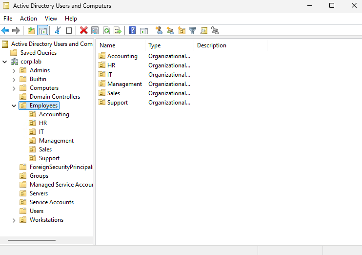
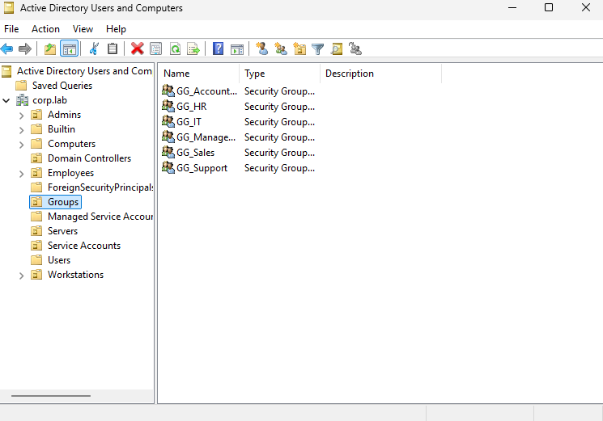
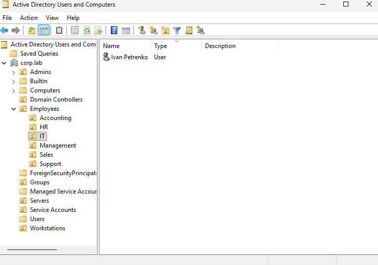
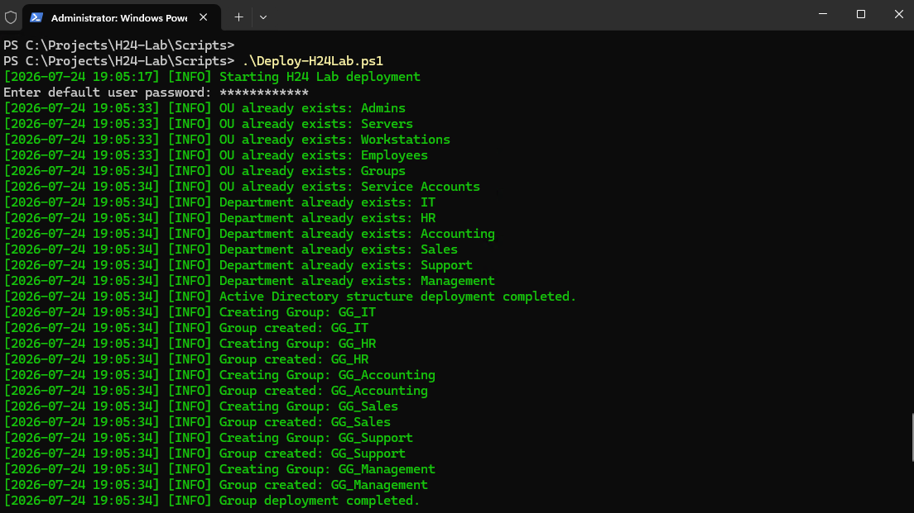

# H24-Lab


Enterprise Active Directory Lab built with **PowerShell**, **Windows Server 2025**, and **Microsoft Azure**.

---

# Overview

H24-Lab is my personal infrastructure automation project focused on Windows Server administration and PowerShell.

The purpose of this repository is to automate the deployment of a complete Enterprise Active Directory environment using Infrastructure as Code (IaC) principles.

Instead of configuring everything manually, the entire lab can be deployed, validated, and removed automatically using PowerShell scripts.

The project continues to evolve as I learn new Windows Server technologies and enterprise administration practices.

---

# Features

- Automated Active Directory deployment
- Organizational Unit (OU) creation
- Department OU structure
- Security Group creation
- Bulk user provisioning from CSV
- Automatic group membership assignment
- Group Policy Object (GPO) deployment
- Automated environment validation
- Safe lab cleanup with WhatIf/Confirm support
- PowerShell logging
- Idempotent deployment

---

# Technologies

- Windows Server 2025
- Active Directory Domain Services
- PowerShell
- Group Policy
- Microsoft Azure
- Git
- GitHub

---

# Project Structure

```text
H24-Lab
│
├── Assets
│   ├── deployment.png
│   ├── groups.png
│   ├── ou-structure.png
│   └── users.png
│
├── Config
│   ├── Company.json
│   └── GPO.json
│
├── Docs
│   └── ActiveDirectoryDesign.md
│
├── Logs
│   └── Deploy.log
│
├── Modules
│   └── H24.ActiveDirectory.psm1
│
├── Scripts
│   ├── Create-OUs.ps1
│   ├── Create-Groups.ps1
│   ├── Create-GPO.ps1
│   ├── Create-Users.ps1
│   ├── Deploy-H24Lab.ps1
│   ├── Test-H24Lab.ps1
│   └── Destroy-H24Lab.ps1
│
├── Users
│   └── Users.csv
│
└── README.md
```

---

# Usage

Clone the repository:

```powershell
git clone https://github.com/m47116339-a11y/H24-Lab.git
```

Open the Scripts directory:

```powershell
cd H24-Lab\Scripts
```

Deploy the lab:

```powershell
.\Deploy-H24Lab.ps1
```

Validate the deployment:

```powershell
.\Test-H24Lab.ps1
```

Remove the lab:

```powershell
.\Destroy-H24Lab.ps1
```

---

# Project Workflow

```text
Deploy-H24Lab.ps1
        │
        ▼
Test-H24Lab.ps1
        │
        ▼
Destroy-H24Lab.ps1
        │
        ▼
Deploy-H24Lab.ps1
```

The project supports a complete deployment lifecycle:

- Deploy the environment
- Validate the deployment
- Remove the environment
- Re-deploy from scratch

---

# Scripts

| Script | Description |
|---------|-------------|
| Deploy-H24Lab.ps1 | Deploys the complete Active Directory lab |
| Test-H24Lab.ps1 | Validates the deployed environment |
| Destroy-H24Lab.ps1 | Safely removes the entire lab |
| Create-OUs.ps1 | Creates the Active Directory OU structure |
| Create-Groups.ps1 | Creates department security groups |
| Create-GPO.ps1 | Creates and links Group Policy Objects |
| Create-Users.ps1 | Imports users from CSV and assigns group membership |

---

# Example Output

```text
[INFO] Starting H24 Lab deployment

[INFO] OU created: Employees
[INFO] Group created: GG_IT
[INFO] User created: ipetrenko
[INFO] Added ipetrenko to GG_IT

[INFO] Lab validation completed successfully.
```

---

# Project Preview

## Active Directory Structure



---

## Security Groups



---

## Users



---

## Deployment Output



---

# Roadmap

## Completed

- [x] Active Directory design
- [x] Organizational Unit deployment
- [x] Department OU structure
- [x] Security Group deployment
- [x] CSV user provisioning
- [x] User deployment
- [x] Automatic group membership
- [x] Group Policy deployment
- [x] Deployment logging
- [x] Automated deployment
- [x] Automated validation
- [x] Automated cleanup

## Planned

- [ ] File Server automation
- [ ] SMB Shares
- [ ] NTFS permissions
- [ ] Home folders
- [ ] DNS automation
- [ ] DHCP automation
- [ ] Pester tests
- [ ] GitHub Actions (CI/CD)

---

# Project Status

✅ **Version 1.0 — Core Active Directory Automation Completed**

Current functionality:

- Active Directory deployment
- User provisioning
- Security Group management
- Group Policy deployment
- Environment validation
- Safe environment cleanup

Next milestone:

- File Server automation

---

# License

This project is licensed under the MIT License.

---

# Author

Created by **Maxim** as part of my Windows Server and PowerShell learning journey.